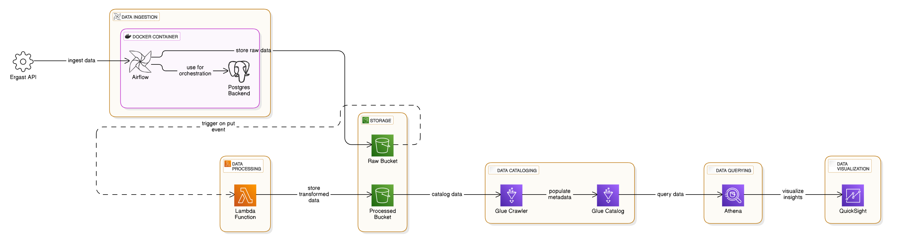

# Formula 1 Season Analysis Data Pipeline Project 🚦🏎️
# Overview
This project demonstrates a data pipeline designed to process and analyze Formula 1 race results data using a combination of modern data engineering tools and cloud services. The pipeline orchestracted using Apache Airflow ingests raw data from the ergast API , processes using AWS lambda and stores it in AWS S3, and catalogging data using AWS glue enables querying and visualization with Athena and QuickSight.

### 1. Data Ingestion:

- Fetches Formula 1 race data from the Ergast API using an Airflow DAG.
- Raw data is dumped into an S3 bucket for storage.
- There are 2 dags created, one setup to ingest the latest available results from the api.
- The other dag to ingest historical race results data either for a specified race or a complete season.
- The pipline is made to be idempotent ensuring that reprocessing a certain result doesn't create duplicates in our storage location ensuring safety during backfills. 
### 2. Data Processing:

- A Lambda function is triggered on an S3 put event to clean and process the raw data and store the processed results in another processed S3 bucket in parquet.
### 3. Data Cataloging:
- AWS Glue Crawler is used to catalog the processed data.

### 4. Data Querying & Visualization:
- Processed data is queried using AWS Athena.
- Visualized to gain season stats and insights using Amazon QuickSight.

### 5. Tracking Processed Data:
- Airflow uses PostgreSQL as its backend.
- A processed_races table tracks the last processed races and their dates to help understand availability of new race data to ingest from the api.
- The processed_races table enables us to prevent redundant processing of the data.

# Tech Stack ⚙️
- **Programming Language**: Python
- **Orchestration**: Apache Airflow
- **Storage**: AWS S3
- **Processing**: AWS Lambda
- **Cataloging**: AWS Glue
- **Querying**: AWS Athena
- **Visualization**: AWS QuickSight
- **Database**: PostgreSQL

# Architecture 🏗️

The following components form the architecture of the project:
### 1. Data Source
The Ergast Developer API is an experimental web service which provides a historical record of motor racing data for non-commercial purposes. The API provides data for the Formula One series, from the beginning of the world championships in 1950. Link to the API [Ergast API Docs](https://ergast.com/mrd/). 
 The API is to be **depricated** soon.
### 2. Containzerization and Orchestration:
- **Docker** is used to containerize the airflow instance with postgres backend.
- **Airflow** Manages the workflow of race results ingestion and tracking.
- **PostgreSQL** serves as the Airflow metadata database and local DB totrack races processed.
### 3. AWS Services:

- **S3**: Storage for raw API json data and processed parquet race data.
- **Lambda**: Processes raw json data cleans and moves it to the processed S3 bucket in parquet.
- **Glue Crawler**: Creates a data catalog for Athena queries.
- **Athena**: Enables SQL-like queries on the processed results data.
- **QuickSight**: Visualizes the processed race results data for insights

# Project Files
- dags/ : contains two dags
     - f1_process_latest_dag.py : ingests the latest race results if available
     - f1_etl_dag.py: ingest and process historical race results data either for a season or specified race.
- etls/ : contains files with python functions used by the dags to perform extract and load operations from the API to the S3 bucket.
- config/ : contains a .conf files used to store the database related configurations
- utils/ : contains constants.py used to define contans from the config file.
- airflow.env : define airflow envionment vaiable to define the the executor, metadatabd and other config parameters for airflow
- docker-compose.yml : Airflow setup with PostgreSQL backend, Celery Executor and redis broker
- Dockerfile: to setup custom dependencies.
- requirements.txt : contains requirements list of dependencies for the project.
  
# Future Enhancements 🛠️
- Implement a proper dimensional model for data warehousing instead of the current one big table approach.
- Add support for streaming real-time race data.

